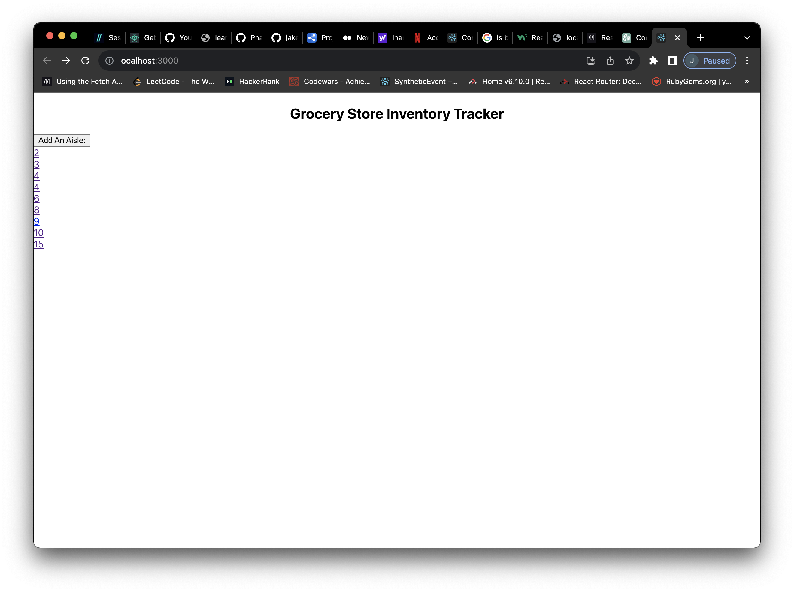

# Grocery Store Inventory Tracker

This web app is a grocery store inventory tracker created using Create React App. It allows users to manage grocery store aisles and products.

## Components

- `App.js`: The main application component.
- `AisleLinks.js`: Component for displaying a list of aisles.
- `AisleForm.js`: Component for adding a new aisle to the database.
- `ProductList.js`: Component for displaying products in an aisle.
- `Product.js`: Component for displaying individual product details.
- `ProductForm.js`: Component for adding a new product to an aisle.
- `EditProductForm.js`: Component for editing an existing product's name or price.

## Features

- Upon loading, the app fetches and displays a list of aisles from the backend database.
- Users can add new aisles to the database using the `AisleForm` component.
- Users can view the products contained in each aisle using the `ProductList` component.
- Products can be added to an aisle using the `ProductForm` component.
- Users can edit existing product names or prices using the `EditProductForm` component.

## Screenshots

*Caption: This is the app's main interface upon loading.*

*Caption: App displaying a list of items in aisle 2 after clicking the #2 link on the main interface.*

*Caption: Adding a product to aisle 2.*

*Caption: Updating an existing product's details in aisle 2.*

## Installation

1. Clone the repository: https://github.com/jakebroffman/Phase-3-Sinatra-React-Project-2
2. Change into the project directory: cd Phase-3-Sinatra-React-Project-2
3. Install dependencies: npm install
4. Start the development server: npm start
5. Open your web browser and visit http://localhost:3000 to view the app.

## Backend Integration

This app was built to utilize a backend built around an ActiveRecord API, the repository for the backend created can be found here: https://github.com/jakebroffman/phase-3-sinatra-react-project

## Contributing

If you'd like to contribute to this project, please follow our Contributing Guidelines (CONTRIBUTING.md).

## License

This project is licensed under the MIT License (LICENSE).

